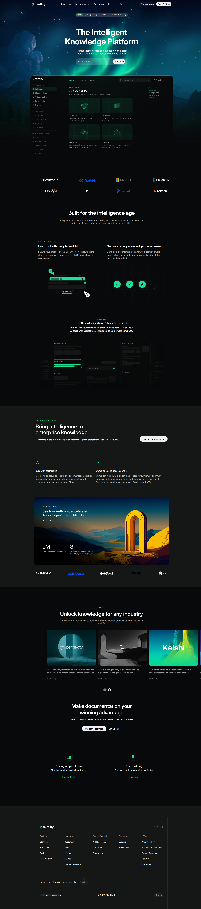

# Mintlify Clone - Documentation Website

A desktop-first, HTML and CSS recreation of the Mintlify documentation platform website. This project focuses on content structure, readability, and layout accuracy without any JavaScript, animations, or responsive design.

## Project Preview


## 📋 Project Overview

This is a static website clone inspired by [Mintlify.com](https://mintlify.com), built purely with **HTML and CSS** to match the original design as closely as possible. The site demonstrates modern web design principles including dark mode UI, glassmorphism effects, and clean typography.


## ✅ Sections Recreated

All 10 major sections from the assignment have been successfully implemented:

### 1. **Top Navigation Bar**
- Mintlify logo with wordmark
- Navigation links: Resources, Documentation, Customers, Blog, Pricing
- CTA buttons: "Contact Sales" and "Start for free"
- Fixed position with backdrop blur effect

### 2. **Hero Section**
- Main headline: "The Intelligent Knowledge Platform"
- Descriptive subtext about AI-enabled documentation
- Email input field with "Start now" CTA button
- "NEW" badge with feature announcement
- Large hero background illustration

### 3. **Trusted By / Company Logos**
- Grid layout displaying 8 company logos (2×4)
- Includes: Anthropic, Coinbase, Microsoft, Perplexity, HubSpot, X, PayPal, Lovable
- Clean, minimal spacing for professional appearance

### 4. **Feature Highlights Section**
- "Built for the Intelligence Age" section header
- Two-column card layout:
  - **"Built for people and AI"** – LLMs.txt & MCP support with visual
  - **"Self-updating knowledge management"** – Agent-powered content updates
- Large single card: **"Intelligent Assistant"** – AI-powered user guidance

### 5. **Intelligent Assistant / UI Preview**
- Full-width mockup card with description
- Image showcase of the assistant interface
- Supporting text explaining the feature

### 6. **Enterprise Features Section**
- Dark background section (secondary background color)
- Enterprise-grade messaging
- Two feature blocks:
  - Build with partnership (white-glove support)
  - Compliance and access control (SOC 2, GDPR)
- Anthropic customer story card with metrics (2M+ monthly developers, 3+ products)

### 7. **Case Studies / Customer Stories**
- Anthropic case study card with background image
- Key metrics and testimonial layout
- Company logo row below (Anthropic, Coinbase, HubSpot, Zapier, AT&T)

### 8. **Customer Showcase Section**
- "Unlock knowledge for any industry" section
- Industry showcase visual grid
- Tagline about leaders scaling with Mintlify

### 9. **Final Call-to-Action**
- Strong headline: "Make documentation your winning advantage"
- Supportive tagline
- Two CTA buttons: "Get started for free" and "Get a demo"
- Three info cards with icons:
  - Pricing on your terms
  - Start building
  - Quickstart resources

### 10. **Footer**
- Multi-column link structure with 5 sections:
  - Explore (Startups, Enterprise, Switch, OSS Program)
  - Resources (Customers, Blog, Pricing, Guides)
  - Getting Started (API Reference, Components, Changelog)
  - Company (Careers, Wall of love)
  - Legal (Privacy, Terms, Security, DSR/DSAR)
- Social media links (LinkedIn, X, GitHub)
- Enterprise security badge
- Status and theme toggle indicators

---

## 🎨 Design System

### Fonts

- **Primary Font:** `Inter` (Google Fonts)
  - Available weights: 100–900
  - Fallback: `sans-serif`
  - Import: `https://fonts.googleapis.com/css2?family=Inter:ital,opsz,wght@0,14..32,100..900`
  - Used for all body text, headings, buttons, and navigation

### Colors

All colors are defined as CSS custom properties in the `:root` selector:

| Variable | Value | Usage |
|----------|-------|-------|
| `--background-color` | `#08090a` | Main page background |
| `--second-bg-color` | `#151616` | Enterprise section background |
| `--hero-bg-color` | `lab(100 0 0 / 0.15)` | Hero input container, highlights |
| `--text-color` | `#ffffff` | Primary text |
| `--faint-text-color` | `lab(100 0 0 / 0.7)` | Muted/secondary text |
| `--border-color` | `#131415` | Card borders, dividers |
| `--black-text-color` | `lab(2.42579 -0.165291 -0.470081)` | Dark button backgrounds |
| `--button-white-bg` | `lab(100 0 0)` | White button backgrounds |
| `--button-black-bg` | `lab(100 0 0 / 0.05)` | Subtle button backgrounds |

**Additional Colors:**
- Accent green/teal: `lab(79.9844 -59.6292 22.5096)` – Section badges, links
- Footer borders: `#262727`

### Typography Scale

- **H1 Headlines:** 40–61.28px, font-weight: 600
- **H2 Subheadings:** 24px, font-weight: 500
- **Body Text:** 16–18px, font-weight: 400
- **Small Labels:** 12–15px, font-weight: 500
- **Line Heights:** 1.4–1.6 for readability

### Layout Features

- **Desktop-first:** Optimized for 1920×1080+ displays
- **Max-width sections:** 65–72% of viewport for centered content
- **Spacing:** Consistent 24–100px margins/padding
- **Border Radius:** 24px for cards, 28px for rounded buttons
- **Backdrop Effects:** 12px blur on navbar for glassmorphism

---

## 🛠️ Tech Stack

- **HTML5** – Semantic markup
- **CSS3** – Modern styling with custom properties, Grid, and Flexbox
- **No dependencies** – Pure static site
- **Constraints met:**
  - ✅ HTML & CSS only (no JavaScript)
  - ✅ No Tailwind CSS
  - ✅ No AI-generated content
  - ✅ No animations or fancy effects
  - ✅ Desktop-only design
  - ✅ Brand assets from original Mintlify site

---

## 📁 Project Structure

```
ChaiaurCode-Mintlify-Clone/
├── index.html                  # Main HTML file
├── style.css                   # All styling
├── README.md                   
└── assets
```

## Author

### Krish Varma


